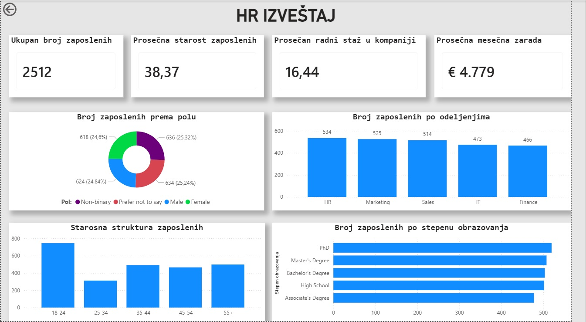
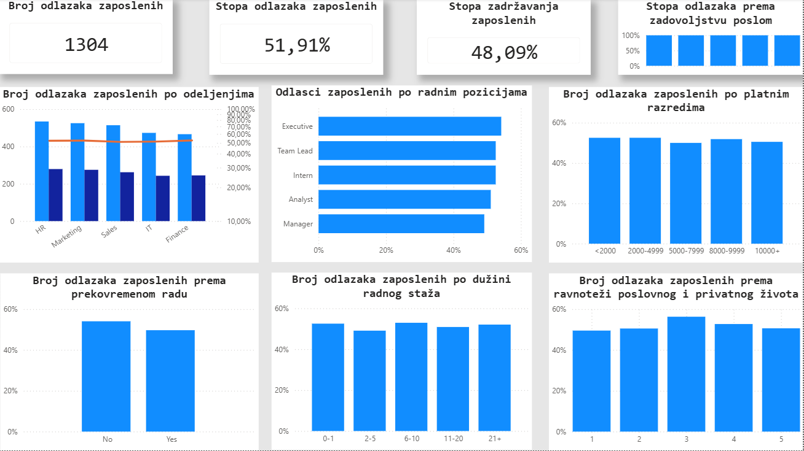

# HR Analytics Dashboard

## About the Project

This project is an HR Analytics dashboard developed in Microsoft Power BI.

The dashboard provides insights into employee demographics, workforce characteristics, and employee attrition. The goal is to analyze workforce data and identify patterns related to employee turnover.

## Project Objectives

* Analyze employee demographics
* Analyze employee attrition
* Identify departments and job roles with higher attrition
* Analyze attrition by salary band
* Analyze the relationship between overtime and attrition
* Analyze attrition by tenure
* Analyze work-life balance
* Identify key workforce trends and patterns

## Tools & Technologies

* Microsoft Power BI
* DAX
* Power Query
* Excel / CSV

## Data Preparation

The dataset was cleaned and transformed using Power Query before being used in the Power BI data model.

The data preparation process included:

* Cleaning and transforming columns
* Correcting data types
* Handling inconsistent data
* Creating calculated columns
* Creating categories and groups for analysis
* Checking data quality

## Dashboard

### HR Overview



### Attrition Analysis



## Key Metrics

The dashboard includes several key HR metrics, including:

* Total Employees
* Attrition Count
* Attrition Rate
* Average Employee Age
* Average Tenure
* Employee Distribution by Department
* Employee Distribution by Job Role

## Attrition Analysis

The dashboard analyzes employee attrition across several dimensions:

* Department
* Job Role
* Salary Band
* Overtime
* Tenure
* Work-Life Balance

These analyses help identify patterns in employee turnover and provide a better understanding of workforce trends.

## DAX

DAX was used to create calculated measures and support the analysis.

Example:

```DAX
Attrition Rate =
DIVIDE(
    [Employees Left],
    [Total Employees]
)
```

Additional DAX measures were created for employee counts, attrition analysis, and other HR metrics.

## Key Insights

The dashboard can be used to identify:

* Which departments have higher employee attrition
* Which job roles experience higher turnover
* Whether overtime is associated with higher attrition
* How tenure relates to employee turnover
* How work-life balance relates to attrition
* Differences in attrition across salary bands

## Project Purpose

This project was created as part of my Data Analytics learning journey to practice:

* Data cleaning
* Data transformation
* Data modeling
* DAX
* Data visualization
* Business analysis
* Power BI dashboard development

## Author
Stefan Petrović
